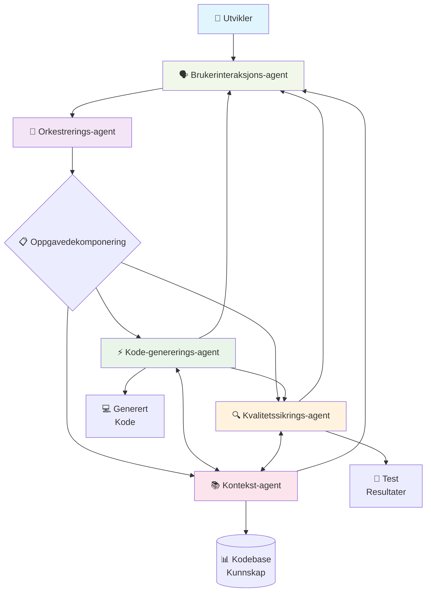

# Polyglot Agentic Developer (PAD) Framework

**En strategisk arkitektur for en fremtidig AI-drevet applikasjonsutvikler**

[](https://github.com/GizzZmo/Polyglot-Agentic-Developer-PAD-Framework-/actions)
[](https://flake8.pycqa.org/)
[](http://mypy-lang.org/)
[](LICENSE)

PAD-rammeverket representerer en revolusjonerende tilnærming til AI-assistert programvareutvikling. Dette GitHub-prosjektet presenterer det konseptuelle rammeverket og den tekniske planen for **Polyglot Agentic Developer (PAD)**, en neste generasjons AI-programmeringspartner som fungerer som en senior, flerspråklig applikasjonsutvikler.

## 🎯 Prosjektmål og Visjon

PAD-systemet er designet for å:
- **Autonomt utføre komplekse programvareutviklingsarbeidsflyter** fra idé til produksjonsklar kode
- **Produsere demonstrerbart høy kvalitet og sikker kode** gjennom flerlags validering
- **Integrere sømløst** med eksisterende utviklingsøkosystemer og arbeidsflyter
- **Understøtte polyglott utvikling** på tvers av programmeringsspråk og teknologier
- **Opprettholde menneske-AI samarbeid** med intuitive grensesnitt og tilbakemelding

## ✨ Nøkkelfunksjoner

### 🌐 Polyglott Kapasiteter
- **Multi-språk kodegenerering**: Python, JavaScript/TypeScript, Java, C#, Go, Rust, og flere
- **Framework-awareness**: React, Django, Spring, .NET, Express.js, og andre populære frameworks
- **Database-integrasjon**: SQL og NoSQL databaser med optimaliserte spørringer
- **API-utvikling**: RESTful og GraphQL API-er med automatisk dokumentasjon

### 🤖 Agent-basert Arkitektur
- **Spesialiserte AI-agenter** som jobber sammen for å fullføre komplekse utviklingsoppgaver
- **Intelligent oppgavedelegering** basert på agentkompetanse og kontekst
- **Kontinuerlig læring** og forbedring gjennom agent-interaksjoner

### 🔍 Kvalitetssikring
- **Flerlags valideringssystem** med sanntids statisk analyse
- **Automatisert testing** med test-generering og kjøring
- **Sikkerhetstesting** og sårbarhetsskanning
- **Performance-optimalisering** og kodekvalitetsmetriker

### 🌍 Kulturell og Språklig Forståelse
- **Naturlig språkforståelse** på norsk og andre språk
- **Lokaliserte datasett** for bedre kontekstforståelse
- **Kulturelt-aware koding** med regionale best practices

### 🔗 Sømløs Integrering
- **IDE-plugins** for VS Code, JetBrains IDEs, og andre populære editorer
- **CI/CD-pipeline integrasjon** med GitHub Actions, Jenkins, og lignende
- **Version control** smart integration med Git og andre VCS
- **Cloud deployment** støtte for AWS, Azure, GCP, og andre platformer

---

## 🏗️ Arkitektur: Multi-Agent System

PAD-rammeverket er bygget på en sofistikert arkitektur som består av fem kjerneagenter, koordinert av en sentral orkestreringsagent. Hver agent har spesialiserte kapasiteter som sammen dekker hele spekteret av programvareutvikling.

### Arkitekturdiagram



### 🎭 Agentroller og Ansvarsområder

#### 🧠 Orkestrerings-agent (OrchestratorAgent)
**Hovedansvar**: Planlegging, koordinering, og delegering av utviklingsoppgaver

**Kapasiteter**:
- 📋 Oppgavedekomponering og planlegging
- 🎯 Intelligent delegering til spesialiserte agenter
- 📊 Fremdriftssporing og koordinering
- 🔄 Arbeidsflyt-optimalisering
- ⚖️ Ressursbalansering mellom agenter

#### ⚡ Kode-genererings-agent (CodeGenAgent)
**Hovedansvar**: Generere, refaktorere og optimalisere kode på tvers av språk

**Kapasiteter**:
- 💻 Polyglott kodegenerering (Python, JS, Java, C#, Go, Rust, etc.)
- 🔧 Intelligent refaktorering og optimalisering
- 📐 Arkitekturmønster-implementasjon
- 🏗️ Framework-spesifikk kodegenerering
- 📝 Automatisk dokumentasjonsgenerering

#### 🔍 Kvalitetssikrings-agent (QualityAssuranceAgent)
**Hovedansvar**: Sikre kodeintegritet gjennom analyse og testing

**Kapasiteter**:
- 🔍 Avansert statisk kodeanalyse
- 🧪 Automatisk test-generering og kjøring
- 🛡️ Sikkerhetssårbarhet-scanning
- 📈 Performance-profiling og optimalisering
- 📏 Kodestil og standard-håndheving

#### 📚 Kontekst-agent (ContextAgent)
**Hovedansvar**: Opprettholde og administrere kodebase-kunnskap

**Kapasiteter**:
- 🗺️ Kodebase-kartlegging og -analyse
- 🔗 Avhengighetssporing og -håndtering
- 📖 API-dokumentasjon og -discovery
- 🎨 Designmønster-gjenkjenning
- 🏛️ Arkitekturforståelse og -vedlikehold

#### 🗣️ Brukerinteraksjons-agent (UserInteractionAgent)
**Hovedansvar**: Kommunikasjon og grensesnitt med utvikleren

**Kapasiteter**:
- 💬 Naturlig språk-interaksjon på norsk og engelsk
- 📋 Intelligent prompt-engineering guidance
- 📊 Rik tilbakemelding med visualiseringer
- 🎓 Kontekstuell læring og veiledning
- 🔔 Proaktive forslag og anbefalinger

### 🔄 Dataflyt og Kommunikasjon

1. **Initiering**: Utvikler sender forespørsel via UserInteractionAgent
2. **Planlegging**: OrchestratorAgent analyserer og dekomponerer forespørselen
3. **Kontekst**: ContextAgent gir relevant kodebase-informasjon
4. **Utførelse**: CodeGenAgent genererer kode basert på plan og kontekst
5. **Validering**: QualityAssuranceAgent kontrollerer og forbedrer kodekvalitet
6. **Tilbakemelding**: Resultater presenteres via UserInteractionAgent
7. **Iterasjon**: Prosessen gjentas basert på tilbakemelding og forbedringer

---

## 🚀 Kom i gang

### ⚙️ Systemkrav

- **Python**: 3.9 eller nyere
- **Git**: For versjonskontroll og kloning
- **Operativsystem**: Windows 10+, macOS 10.15+, eller Linux (Ubuntu 20.04+)
- **Minne**: Anbefalt 8GB RAM for optimal ytelse
- **Diskplass**: Minimum 2GB tilgjengelig plass

### 📦 Installasjon

#### 1. Klon Repository
```bash
git clone https://github.com/GizzZmo/Polyglot-Agentic-Developer-PAD-Framework-.git
cd Polyglot-Agentic-Developer-PAD-Framework-
```

#### 2. Opprett Virtuelt Miljø
```bash
# På macOS/Linux
python3 -m venv venv
source venv/bin/activate

# På Windows
python -m venv venv
venv\Scripts\activate
```

#### 3. Installer Avhengigheter
```bash
pip install -r requirements.txt
```

#### 4. Konfigurer Miljø (Valgfritt)
```bash
# Kopier eksempel-konfigurasjon
cp .env.example .env

# Rediger .env med dine API-nøkler og preferanser
nano .env
```

### 🎯 Grunnleggende Bruk

#### Starte PAD-systemet
```bash
python main.py
```

#### Eksempel-interaksjon
```
PAD > lag en REST API for brukeradministrasjon med Flask

[PAD]: Analyserer forespørsel...
[PAD]: Genererer Flask API med følgende komponenter:
       - User model med SQLAlchemy
       - Authentication middleware
       - CRUD endpoints
       - Input validation
       - API dokumentasjon

[PAD]: Kodegenerering fullført. Kjører kvalitetssikring...
[PAD]: ✅ Statisk analyse bestått
[PAD]: ✅ Sikkerhetssjegg bestått  
[PAD]: ✅ Tester generert og kjørt

Vil du se den genererte koden? (y/n)
```

### 🔧 Avansert Konfigurasjon

#### API-nøkler
For full funksjonalitet, konfigurer følgende i `.env`:
```env
OPENAI_API_KEY=your_openai_key_here
ANTHROPIC_API_KEY=your_anthropic_key_here
GITHUB_TOKEN=your_github_token_here
```

#### Agent-innstillinger
```env
# Kodegenerering
CODEGEN_MODEL=gpt-4
CODEGEN_TEMPERATURE=0.2

# Kvalitetssikring
QA_STRICT_MODE=true
QA_AUTO_FIX=true

# Kontekst
CONTEXT_MAX_FILES=1000
CONTEXT_ANALYSIS_DEPTH=deep
```

---

## 📚 Detaljert Brukerveiledning

### 🎯 Grunnleggende Kommandoer

#### Kodegenerering
```
PAD > lag en funksjon som sorterer en liste med bubble sort
PAD > implementer en binary search algoritme i Python
PAD > opprett en React komponent for en produktliste
```

#### Refaktorering
```
PAD > refaktorer denne funksjonen for bedre ytelse: [kode]
PAD > optimaliser denne databasespørringen: [SQL]
PAD > moderniser denne JavaScript-koden til ES6+
```

#### Analyse og Debugging
```
PAD > analyser denne koden for potensielle problemer: [kode]
PAD > forklar hva denne funksjonen gjør: [kode]
PAD > finn og fiks bugs i denne implementasjonen: [kode]
```

### 🔍 Avanserte Funksjoner

#### Prosjekt-basert Utvikling
```
PAD > opprett et nytt Django prosjekt med brukerautentisering
PAD > legg til en REST API til det eksisterende Flask prosjektet
PAD > implementer enhetstester for alle kontrollere
```

#### Arkitektur og Design
```
PAD > foreslå en arkitektur for et e-handelssystem
PAD > implementer Observer pattern i TypeScript
PAD > refaktorer monolitt til mikrotjenester
```

#### Database og Optimalisering
```
PAD > design en databaseskjema for et bloggingsystem
PAD > optimaliser denne spørringen for bedre ytelse
PAD > implementer caching-strategi for dette API-et
```

---

## 🧪 Testing og Kvalitetssikring

### Kjøre Tester
```bash
# Alle tester
python -m pytest

# Med detaljer
python -m pytest -v

# Spesifikk test
python -m pytest pad/tests/test_orchestrator.py

# Med coverage
python -m pytest --cov=pad
```

### Kodekvalitet
```bash
# Linting
flake8 .

# Type checking
mypy .

# Sikkerhetsskanning
bandit -r pad/

# Kompleksitetsanalyse
radon cc pad/
```

### Kontinuerlig Integrasjon
Prosjektet er konfigurert med GitHub Actions for:
- ✅ Automatisk testing på multiple Python-versjoner
- 🔍 Kodekvalitetskontroll
- 🛡️ Sikkerhetsskanning
- 📊 Coverage-rapportering

---

## 🛠️ Utvikling og Bidrag

### 🎯 Utviklingsmiljø
```bash
# Installer utviklingsavhengigheter
pip install -r requirements-dev.txt

# Pre-commit hooks
pre-commit install

# Start utviklingsserver
python main.py --dev-mode
```

### 📝 Kodestandard
- **PEP 8** for Python-kodestil
- **Type hints** påkrevd for alle offentlige funksjoner
- **Docstrings** i Google-format
- **100% test coverage** for nye funksjoner

### 🤝 Bidragsprosess
1. **Fork** repository-et
2. **Opprett feature branch**: `git checkout -b feature/amazing-feature`
3. **Implementer** endringer med tester
4. **Kjør** kvalitetskontroll: `flake8`, `mypy`, `pytest`
5. **Commit** med beskrivende melding
6. **Push** til din fork: `git push origin feature/amazing-feature`
7. **Opprett** Pull Request med detaljert beskrivelse

---

## 📋 Teknologi og Avhengigheter

### 🐍 Kjerneteknologier
- **Python 3.9+** – Hovedspråk for agentimplementasjon
- **OpenAI/Anthropic APIs** – For avansert naturlig språkforståelse
- **FastAPI** – For REST API-eksponering (planlagt)
- **SQLAlchemy** – For databaseabstraksjon (planlagt)
- **Docker** – For isolasjon og distribusjon

### 🧪 Testing og Kvalitet
- **pytest** – Testrammeverk
- **mypy** – Statisk typesjekking
- **flake8** – Kodestil og kvalitet
- **black** – Kodeformatering
- **bandit** – Sikkerhetsskanning

### 📊 Visualisering og Dokumentasjon
- **Mermaid** – Diagrammer og visualiseringer
- **Sphinx** – API-dokumentasjon (planlagt)
- **MkDocs** – Brukerdokumentasjon (planlagt)

### 🔗 Integrering
- **GitHub API** – For repository-interaksjon
- **Docker** – For containerisering
- **Redis** – For caching (planlagt)
- **PostgreSQL** – For persistens (planlagt)

---

## 🔧 Feilsøking

### ❓ Vanlige Problemer

#### Installasjonsproblemer
```bash
# Python versjon sjekk
python --version  # Bør være 3.9+

# Virtual environment problemer
deactivate
rm -rf venv
python -m venv venv
source venv/bin/activate
pip install -r requirements.txt
```

#### API-konfigurasjon
```bash
# Sjekk .env fil
cat .env

# Test API-tilkobling
python -c "import openai; print('OpenAI konfigurert')"
```

#### Performance-problemer
```bash
# Sjekk systemressurser
htop  # eller Task Manager på Windows

# Reduser agent-kompleksitet i .env
CONTEXT_ANALYSIS_DEPTH=shallow
CODEGEN_MAX_TOKENS=1000
```

### 📞 Få Hjelp

- **GitHub Issues**: [Rapporter bugs eller be om funksjoner](https://github.com/GizzZmo/Polyglot-Agentic-Developer-PAD-Framework-/issues)
- **Discussions**: [Diskuter ideer og spørsmål](https://github.com/GizzZmo/Polyglot-Agentic-Developer-PAD-Framework-/discussions)
- **Wiki**: [Detaljert dokumentasjon](https://github.com/GizzZmo/Polyglot-Agentic-Developer-PAD-Framework-/wiki)

---

## 🗺️ Roadmap og Fremtidsplaner

### 🎯 Versjon 1.0 (Planlagt Q2 2024)
- ✅ Grunnleggende agent-arkitektur
- ⏳ LLM-integrasjon for kodegenerering
- ⏳ Avansert kvalitetssikring
- ⏳ IDE-plugin for VS Code

### 🚀 Versjon 2.0 (Planlagt Q4 2024)
- ⏳ Multi-språk støtte (10+ språk)
- ⏳ Cloud-deployment automatisering
- ⏳ Avansert kontekstforståelse
- ⏳ Team-samarbeidsfunksjoner

### 🌟 Versjon 3.0 (Planlagt 2025)
- ⏳ Selvlærende agenter
- ⏳ Prediktiv kodegenerering
- ⏳ Integrert CI/CD automatisering
- ⏳ Enterprise-funksjoner

---

## 📄 Lisens

Dette prosjektet er lisensiert under MIT-lisensen. Se [LICENSE](LICENSE)-filen for detaljer.

### 🤝 Bidragsytere

Tusen takk til alle som bidrar til PAD-rammeverket:

- **GizzZmo** - Hovedutvikler og prosjektleder
- **Community** - Verdifulle tilbakemeldinger og bidrag

---

## 🌟 Anerkjennelser

PAD-rammeverket er inspirert av og bygger videre på:
- **OpenAI** for banebrytende LLM-teknologi
- **Python-samfunnet** for fantastiske verktøy og biblioteker
- **Open source-bevegelsen** for samarbeid og deling av kunnskap

---

**🚀 Utforsk fremtiden for AI-assistert programvareutvikling med PAD!**

*Ønsker du å dykke dypere inn i koden til en spesifikk agent, som for eksempel **Quality Assurance Agent**? Ta kontakt eller åpne en diskusjon!*
