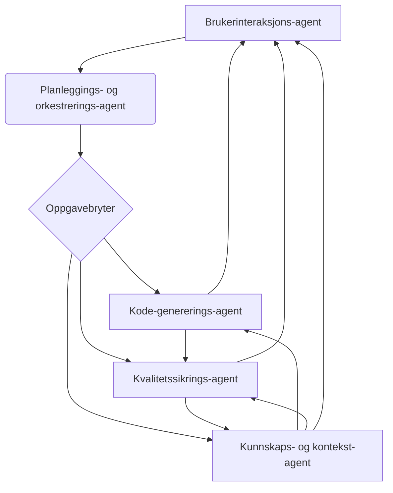

# Polyglot Agentic Developer (PAD) Framework
**En strategisk arkitektur for en fremtidig AI-drevet applikasjonsutvikler**

Dette GitHub-prosjektet presenterer det konseptuelle rammeverket og den tekniske planen for **Polyglot Agentic Developer (PAD)**, en neste generasjons AI-programmeringspartner. PAD-systemet er utformet for å fungere som en senior, flerspråklig applikasjonsutvikler som autonomt kan utføre komplekse, fler-trinns programvareutviklingsarbeidsflyter. Hovedmålet med dette rammeverket er å produsere kode som ikke bare er funksjonell, men også demonstrerbart høy kvalitet og sikker.

## Nøkkelfunksjoner

- **Polyglot:** Kjerne-agenten er utformet for å skrive, refaktorere og optimalisere kode på tvers av en rekke programmeringsspråk.
- **Agent-basert arkitektur:** Systemet opererer som et multi-agent system, med spesialiserte AI-agenter som jobber sammen for å fullføre komplekse utviklingsoppgaver.
- **Kvalitetssikring:** Et flerlags valideringssystem som inkluderer sanntids statisk analyse, automatisert testing og forbedret menneskelig gjennomgang.
- **Kulturell og språklig forståelse:** En hybrid tilnærming som utnytter kraftige basemodeller finjustert med lokaliserte datasett, for å forstå nyansene i naturlig språk som norsk.
- **Sømløs integrering:** Designet for å integreres dypt i populære IDE-er (som VS Code og JetBrains-suiten) og eksisterende utviklingsøkosystemer.

---

## Arkitektur: Kjernen i et Multi-Agent-System

PAD-rammeverket er bygget på en arkitektur som består av fem kjerneagenter, som hver har en spesialisert funksjon. Disse agentene styres av en sentral orkestreringsagent som bryter ned komplekse forespørsler i mindre, håndterbare oppgaver.



**Agentroller:**

- **Planleggings- og orkestrerings-agent:** Fungerer som hjernen i systemet. Den mottar brukerforespørsler, dekomponerer dem til en logisk plan og delegerer oppgaver til de andre agentene.
- **Kode-genererings-agent:** Den polyglotte kjernen som genererer, refaktorerer og optimaliserer kode i et bredt spekter av programmeringsspråk.
- **Kvalitetssikrings-agent:** Ansvarlig for å sikre kodeintegritet. Den utfører kontinuerlig statisk analyse og genererer og kjører automatiske tester.
- **Kunnskaps- og kontekst-agent:** Gir "langtidsminne" ved å opprettholde en intern modell av hele kodebasen, inkludert struktur, avhengigheter og API-er.
- **Brukerinteraksjons-agent:** Håndterer all kommunikasjon med den menneskelige brukeren, gir klar tilbakemelding og veileder mot effektiv prompt engineering.

---

## Teknologi

- **Python 3.8+** – Hovedspråk for agentimplementasjon og orkestrering.
- **OpenAI/LLM API-er** – For avansert naturlig språkforståelse og kodegenerering.
- **FastAPI / Flask** – Til REST API-eksponering (valgfritt).
- **Docker** – For isolasjon og enkel distribusjon.
- **Pytest, MyPy, flake8** – For testing og statisk analyse.
- **Mermaid** – For visuelle diagrammer i dokumentasjonen.

---

## Kom i gang

> **NB:** Dette er et konseptuelt rammeverk. Kodebasen blir tilgjengelig snarlig.

### Forutsetninger

- Python 3.8 eller nyere
- Git

### Installasjon

Klon repository-et:
```bash
git clone https://github.com/ditt-brukernavn/pad-framework.git
cd pad-framework
```

Opprett og aktiver et virtuelt miljø:
```bash
python3 -m venv venv
source venv/bin/activate # macOS/Linux
venv\Scripts\activate    # Windows
```

Installer avhengigheter:
```bash
pip install -r requirements.txt
```

### Bruk

For å starte den sentrale orkestreringsagenten, kjør følgende kommando:
```bash
python main.py
```
Følg instruksjonene i konsollen for å samhandle med PAD-systemet.

---

## Veiledning for bidrag

Vi tar gjerne imot bidrag til dette prosjektet. Følg retningslinjene nedenfor for å sikre en jevn prosess.

### Rapportering av feil

Før du sender inn en ny feilrapport, sjekk om feilen allerede er rapportert i Issues-fanen. Hvis ikke, opprett en ny "issue" og inkluder følgende informasjon:

- En klar og beskrivende tittel.
- Detaljerte trinn for å reprodusere feilen.
- Hva du forventet skulle skje og hva som faktisk skjedde.

### Foreslå nye funksjoner

Nye funksjoner er velkomne! Vennligst opprett en ny "issue" for å diskutere ideen din.

### Kodebidrag

1. Fork repository-et og klon det til din lokale maskin.
2. Opprett en ny gren (branch):
    ```bash
    git checkout -b feature/ny-funksjon
    ```
3. Gjør dine endringer, sørg for å følge kodestandardene.
4. Kjør tester for å sikre at endringene dine ikke introduserer nye feil.
5. Commit endringene dine:
    ```bash
    git commit -m "feat: Legg til ny-funksjon"
    ```
6. Push grenen til ditt repository:
    ```bash
    git push origin feature/ny-funksjon
    ```
7. Opprett en Pull Request (PR) fra din gren til hovedgrenen (main) i dette repository-et.

---

## Lisens

Dette prosjektet er lisensiert under MIT-lisensen. Se LICENSE-filen for detaljer.

---

**Utforsk videre:**  
Ønsker du å dykke dypere inn i koden til en spesifikk agent, som for eksempel **Quality Assurance Agent**? Ta kontakt eller åpne en diskusjon!
