# PAD Framework Arkitektur og Teknisk Spesifikasjon

## Oversikt

PAD (Polyglot Agentic Developer) Framework representerer en avansert multi-agent arkitektur designet for autonome programvareutviklingsarbeidsflyter. Systemet kombinerer spesialiserte AI-agenter som samarbeider for å levere høykvalitets, polyglott kodegenerering med integrert kvalitetssikring.

## Arkitekturprinsipper

### 🏗️ Designfilosofi

**Separation of Concerns**: Hver agent har en klar, avgrenset ansvarsområde som muliggjør spesialisering og vedlikeholdbarhet.

**Modularity**: Agenter er designet som uavhengige moduler som kan utvikles, testes og distribueres separat.

**Interoperability**: Standardiserte grensesnitt sikrer effektiv kommunikasjon mellom agenter.

**Scalability**: Arkitekturen støtter horizontal skalering og parallell prosessering.

**Observability**: Innebygd logging, monitoring og debugging-muligheter for alle agenter.

### 🔄 Kommunikasjonsmønstre

#### Synkron Kommunikasjon
- **Direkte metodekall** for sanntidsinteraksjon
- **Return values** for umiddelbar tilbakemelding
- **Exception handling** for feilhåndtering

#### Asynkron Kommunikasjon (Planlagt)
- **Message queuing** for ikke-kritiske operasjoner
- **Event streaming** for real-time oppdateringer
- **Pub/Sub patterns** for loosely coupled kommunikasjon

## Agent-spesifikke Arkitekturer

### 🧠 OrchestratorAgent Arkitektur

#### Ansvarsområder
- **Task Decomposition**: Bryte ned komplekse forespørsler til håndterbare deloppgaver
- **Agent Coordination**: Administrere arbeidsflyt mellom spesialiserte agenter
- **Resource Management**: Optimalisere ressursbruk og last-balansering
- **Progress Tracking**: Overvåke fremdrift og håndtere feil

#### Komponenter
```python
class OrchestratorAgent:
    def __init__(self):
        self.user_agent: UserInteractionAgent
        self.context_agent: ContextAgent
        self.codegen_agent: CodeGenAgent
        self.qa_agent: QualityAssuranceAgent
        self.task_queue: TaskQueue
        self.execution_tracker: ExecutionTracker
```

#### Arbeidsflyt
1. **Input Processing**: Motta og parse brukerforespørsler
2. **Task Planning**: Generere utførelsesplan med prioriterte oppgaver
3. **Agent Delegation**: Tildele oppgaver til appropriate agenter
4. **Progress Monitoring**: Spore utførelse og håndtere feil
5. **Result Aggregation**: Samle og presentere resultater

### ⚡ CodeGenAgent Arkitektur

#### Kjernekapasiteter
- **Multi-language Support**: Python, JavaScript, TypeScript, Java, C#, Go, Rust
- **Framework Integration**: React, Django, Spring Boot, .NET, Express.js
- **Code Patterns**: Design patterns, architectural patterns, best practices
- **Template System**: Gjenbrukbare kodescaffolds og boilerplates

#### Algoritmekomponenter
```python
class CodeGenAgent:
    def __init__(self):
        self.language_models: Dict[str, LanguageModel]
        self.template_engine: TemplateEngine
        self.pattern_library: PatternLibrary
        self.code_formatter: CodeFormatter
        self.dependency_resolver: DependencyResolver
```

#### Genererings-pipeline
1. **Intent Analysis**: Forstå utviklerens intensjon og krav
2. **Context Integration**: Inkorporere eksisterende kodebase-kunnskap
3. **Template Selection**: Velge appropriate kodescaffolds
4. **Code Generation**: Generere skreddersydd kode
5. **Formatting & Optimization**: Formatere og optimalisere output

### 🔍 QualityAssuranceAgent Arkitektur

#### Validerings-lag
- **Syntactic Analysis**: Syntakskorrekthet og språkspecifikke regler
- **Semantic Analysis**: Logisk korrekthet og kontekstvalidering
- **Security Scanning**: Sårbarhetsdeteksjon og sikkerhetsbest practices
- **Performance Analysis**: Ytelsesoptimalisering og ressursbruk
- **Test Generation**: Automatisk generering av unit og integration tests

#### Verktøyintegrasjon
```python
class QualityAssuranceAgent:
    def __init__(self):
        self.static_analyzers: Dict[str, StaticAnalyzer]
        self.security_scanners: List[SecurityScanner]
        self.test_generators: Dict[str, TestGenerator]
        self.performance_profilers: List[PerformanceProfiler]
        self.linters: Dict[str, Linter]
```

#### QA-pipeline
1. **Static Analysis**: Kodeanalyse uten kjøring
2. **Security Scanning**: Sårbarhetsdeteksjon
3. **Test Generation**: Automatisk testgenerering
4. **Test Execution**: Kjøring av genererte tester
5. **Report Generation**: Kvalitetsrapporter og anbefalinger

### 📚 ContextAgent Arkitektur

#### Kunnskapsdomener
- **Codebase Mapping**: Struktur, filer, moduler, avhengigheter
- **API Discovery**: Interne og eksterne API-er og grensesnitt
- **Design Patterns**: Gjenkjente mønstre og arkitekturer
- **Historical Context**: Endringshistorikk og utviklingsmønstre
- **Documentation**: README, kommentarer, teknisk dokumentasjon

#### Datastrukturer
```python
class ContextAgent:
    def __init__(self):
        self.codebase_graph: CodebaseGraph
        self.dependency_tree: DependencyTree
        self.api_registry: APIRegistry
        self.pattern_detector: PatternDetector
        self.history_tracker: HistoryTracker
```

#### Kontekst-pipeline
1. **Code Parsing**: Analyse av kildekode og struktur
2. **Dependency Analysis**: Kartlegging av avhengigheter
3. **Pattern Recognition**: Identifisering av design patterns
4. **Context Synthesis**: Samle kontekstuell forståelse
5. **Knowledge Updates**: Kontinuerlig læring og oppdatering

### 🗣️ UserInteractionAgent Arkitektur

#### Interaksjonsmønstre
- **Natural Language Processing**: Norsk og engelsk språkforståelse
- **Intent Recognition**: Identifisering av brukerintensjon
- **Context-aware Responses**: Kontekstuell tilbakemelding
- **Progressive Disclosure**: Gradvis informasjonsavsløring
- **Guided Interactions**: Proaktiv veiledning og forslag

#### Grensesnittkomponenter
```python
class UserInteractionAgent:
    def __init__(self):
        self.nlp_processor: NLPProcessor
        self.intent_classifier: IntentClassifier
        self.response_generator: ResponseGenerator
        self.feedback_formatter: FeedbackFormatter
        self.conversation_manager: ConversationManager
```

#### Interaksjon-pipeline
1. **Input Processing**: Parse og forstå brukerinput
2. **Intent Classification**: Klassifiser brukerens intensjon
3. **Context Retrieval**: Hent relevant kontekst
4. **Response Generation**: Generer skreddersydd respons
5. **Feedback Delivery**: Lever formatert tilbakemelding

## Dataflyt og Integrasjon

### 🔄 Hovedarbeidsflyt

```mermaid
sequenceDiagram
    participant U as Bruker
    participant UI as UserInteractionAgent
    participant O as OrchestratorAgent
    participant C as ContextAgent
    participant CG as CodeGenAgent
    participant QA as QualityAssuranceAgent

    U->>UI: Utviklingsforespørsel
    UI->>O: Prosessert forespørsel
    O->>C: Kontekstforespørsel
    C-->>O: Kodebase-kontekst
    O->>CG: Kodegenereringsoppgave
    CG->>C: Kontekstdata
    C-->>CG: Relevant kontekst
    CG-->>O: Generert kode
    O->>QA: Kvalitetsvalidering
    QA-->>O: QA-rapport
    O->>UI: Samlede resultater
    UI->>U: Formatert tilbakemelding
```



### 🗂️ Datamodeller

#### Task Model
```python
@dataclass
class Task:
    id: str
    type: TaskType
    priority: Priority
    description: str
    context: Dict[str, Any]
    dependencies: List[str]
    status: TaskStatus
    created_at: datetime
    updated_at: datetime
```

#### Code Model
```python
@dataclass
class GeneratedCode:
    id: str
    language: str
    content: str
    framework: Optional[str]
    dependencies: List[str]
    metadata: CodeMetadata
    quality_score: float
    test_coverage: float
```

#### Context Model
```python
@dataclass
class CodebaseContext:
    project_type: str
    languages: List[str]
    frameworks: List[str]
    dependencies: DependencyGraph
    api_endpoints: List[APIEndpoint]
    design_patterns: List[DesignPattern]
    file_structure: FileTree
```

## Teknisk Implementasjon

### 🛠️ Teknologistack

#### Kjerneteknologier
- **Python 3.9+**: Primært utviklingsspråk
- **AsyncIO**: Asynkron programmering for skalering
- **Pydantic**: Datavalidering og serialisering
- **SQLAlchemy**: Database ORM (planlagt)
- **Redis**: Caching og session management (planlagt)

#### AI/ML Komponenter
- **OpenAI GPT-4**: Kodegenerering og naturlig språkforståelse
- **Anthropic Claude**: Alternativ LLM for diversitet
- **Sentence Transformers**: Semantisk søk og likhet
- **spaCy**: Naturlig språkprosessering

#### Infrastruktur
- **Docker**: Containerisering
- **Kubernetes**: Orkestrering (planlagt)
- **Prometheus**: Monitoring og metrics (planlagt)
- **Grafana**: Visualisering og dashboards (planlagt)

### 🔧 Konfigurasjon og Tuning

#### Agent-spesifikk Konfigurasjon
```yaml
orchestrator:
  max_concurrent_tasks: 10
  task_timeout: 300
  retry_attempts: 3

codegen:
  model: "gpt-4"
  temperature: 0.2
  max_tokens: 2000
  language_preferences:
    - python
    - typescript
    - go

qa:
  strict_mode: true
  auto_fix_enabled: true
  security_scan_enabled: true
  performance_analysis: true

context:
  max_file_size: 1048576  # 1MB
  analysis_depth: "deep"
  pattern_detection: true
  history_retention_days: 30
```

### 📊 Performance og Skalering

#### Ytelsesmetriker
- **Response Time**: Tid fra forespørsel til svar
- **Throughput**: Antall forespørsler per sekund
- **Quality Score**: Aggregert kvalitetsmetrikk
- **Success Rate**: Andel vellykkede operasjoner

#### Optimaliseringsstrategier
- **Caching**: Intelligente caching-strategier for kontekst og resultater
- **Parallel Processing**: Parallell utførelse av ikke-avhengige oppgaver
- **Model Optimization**: Fintuning av AI-modeller for spesifikke oppgaver
- **Resource Pooling**: Effektiv ressursadministrasjon

## Sikkerhet og Compliance

### 🛡️ Sikkerhetslag

#### Input Validation
- **Sanitization**: Rensing av brukerinput
- **Schema Validation**: Strukturell validering
- **Rate Limiting**: Beskyttelse mot misbruk

#### Code Security
- **Static Analysis**: Sårbarhetsscanning av generert kode
- **Dependency Scanning**: Sjekk av tredjepartsbiblioteker
- **Secret Detection**: Identifisering av hardkodede secrets

#### Infrastructure Security
- **Authentication**: Sikker brukerautentisering
- **Authorization**: Rollebasert tilgangskontroll
- **Encryption**: Kryptering av data i transit og at rest

### 📋 Compliance

#### Data Privacy
- **GDPR Compliance**: Europeisk personvernregulering
- **Data Minimization**: Kun nødvendige data samles
- **Right to Erasure**: Mulighet for datasletting

#### Code Licensing
- **License Scanning**: Automatisk lisensskanning av avhengigheter
- **Compliance Reporting**: Rapporter for lisenskomplians
- **Open Source Policy**: Klar policy for open source bruk

## Overvåking og Debugging

### 📈 Observability

#### Logging
```python
import structlog

logger = structlog.get_logger()

class AgentLogger:
    def log_task_start(self, task_id: str, agent: str) -> None:
        logger.info("Task started", task_id=task_id, agent=agent)
    
    def log_performance(self, operation: str, duration: float) -> None:
        logger.info("Performance metric", operation=operation, duration_ms=duration * 1000)
```

#### Metrics
- **Agent Performance**: Responstid, throughput, feilrate
- **Code Quality**: Kvalitetsmetriker for generert kode
- **System Resources**: CPU, minne, disk, nettverk
- **User Satisfaction**: Brukertilfredshet og feedback

#### Tracing
- **Distributed Tracing**: Sporing på tvers av agenter
- **Request Correlation**: Korrelasjon av relaterte operasjoner
- **Error Tracking**: Detaljert feilsporing og rapportering

### 🐛 Debugging Tools

#### Development Tools
- **Interactive Debugger**: Step-through debugging for agenter
- **Mock Agents**: Testversioner av agenter for isolert testing
- **Simulation Mode**: Simulering av agent-interaksjoner

#### Production Debugging
- **Health Checks**: Kontinuerlig helsemonitorering
- **Circuit Breakers**: Automatisk feilhåndtering
- **Graceful Degradation**: Elegant håndtering av delfeil

## Testing og Kvalitetssikring

### 🧪 Testing-strategi

#### Unit Testing
```python
import pytest
from pad.orchestrator import OrchestratorAgent

class TestOrchestratorAgent:
    def test_task_planning(self):
        orchestrator = OrchestratorAgent()
        plan = orchestrator.plan("Create a REST API")
        assert plan is not None
        assert isinstance(plan, str)
```

#### Integration Testing
- **Agent Interaction**: Testing av kommunikasjon mellom agenter
- **End-to-End**: Fullstendige arbeidsflyter fra start til slutt
- **Performance**: Lastesting og ytelsesvalidering

#### AI Model Testing
- **Code Quality**: Validering av generert kodekvalitet
- **Consistency**: Konsistens i utdata på tvers av kjøringer
- **Bias Detection**: Identifisering av skjevheter i AI-modeller

### 🎯 Kvalitetsmål

#### Code Coverage
- **Minimum 90%** test coverage for alle agenter
- **100%** for kritiske sikkerhetsfunksjoner
- **Automatisk rapportering** i CI/CD pipeline

#### Performance Benchmarks
- **Response Time**: < 5 sekunder for enkle forespørsler
- **Complex Tasks**: < 30 sekunder for komplekse operasjoner
- **Availability**: 99.9% uptime målsetting

## Fremtidsutvikling

### 🚀 Planlagte Forbedringer

#### Versjon 1.1
- **Real-time Collaboration**: Samtidig arbeid fra flere utviklere
- **Advanced Caching**: Intelligent caching for forbedret ytelse
- **Plugin System**: Utvidbart system for tredjepartsintegrasjoner

#### Versjon 2.0
- **Self-Learning**: Agenter som lærer fra brukerinteraksjoner
- **Predictive Coding**: Proaktive kodeforslag basert på kontekst
- **Multi-Modal Input**: Støtte for diagrammer, skisser og voice input

#### Versjon 3.0
- **Autonomous Development**: Fullstendig autonome utviklingsarbeidsflyter
- **Cross-Project Learning**: Læring på tvers av prosjekter og organisasjoner
- **Advanced Reasoning**: Dype resoneringskapasiteter for komplekse problemer

### 🔬 Forskningsområder

- **Emergent Behavior**: Hvordan kompleks atferd oppstår fra agent-interaksjoner
- **Ethical AI**: Sikring av etisk og ansvarlig AI-bruk i koding
- **Human-AI Collaboration**: Optimalisering av menneske-AI samarbeid
- **Code Evolution**: Automatisk evolusjon og forbedring av kodebase over tid

Dette tekniske dokumentet gir et dypdykk i arkitekturen og implementasjonen av PAD Framework. For detaljerte API-referanser og kodeeksempler, se de individuelle agentdokumentene og kildekoden.
