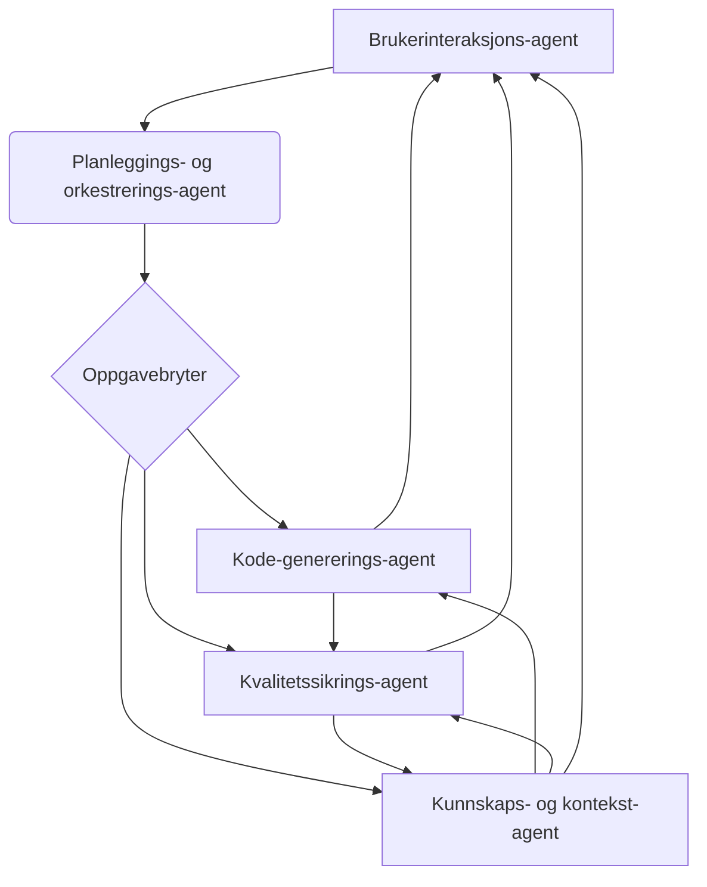

```mermaid
graph TD

A[Brukerinteraksjons-agent] --> B(Planleggings- og orkestrerings-agent);

B --> C{Oppgavebryter};

C --> D[Kode-genererings-agent];
C --> E[Kvalitetssikrings-agent];
C --> F[Kunnskaps- og kontekst-agent];

D --> E;
E --> F;
F --> D;
F --> E;

E --> A;
F --> A;
D --> A;
```
